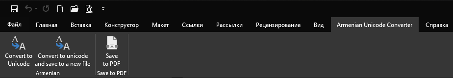
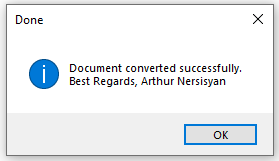
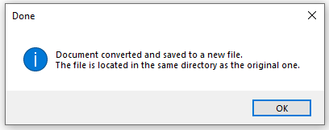

# Armenian Unicode Converter Word AddIn (VSTO)

You can read this in [Русский](./README_RU.md), [Հայերեն](./README_ARM.md)

</br>


## Problem

Many people, when working with text in the Armenian language in Microsoft Word, faced with the problem of incorrect displaying text.

It looks like this:
```
г۳ëï³ÝÇ Ð³Ýñ³å»ïáõÃÛáõÝ
```

And it should look like this:
```
Հայաստանի Հանրապետություն
```

The problem is the lack of some old fonts (Times Armenian) in the system. Of course, you could find, download, install this font and forget about this problem once and for all. But, in the above-mentioned way, of course, you will solve the problem of incorrect display, but you will not be able to edit normally, bring the entire document to one font and formatting. (Why? Because most (ARM) fonts work with a specific encoding, either one or the other, but not both.)


## Solution

The solution to this problem is to convert (replace) the text with the old encoding to `Unicode`


This extension is designed for Microsoft Word.



The extension can do just 3 things:

1. Button `Convert to Unicode` - Convert (replace) all text in the current document to text with` Unicode` encoding
2. Button `Convert to Unicode and save to a new file` - Saves the current document, in the same directory (folder) creates a new document (command` Save As`) with the same name with the suffix `_unicode.docx`, then it converts all text in the new document to text with `Unicode` encoding, saves both files.
3. `Save to PDF` - Convert the current document to` PDF` format and open it.

After completing the first step, the following dialog box is displayed:



After completing the second step, the following dialog box is displayed:



## How to install

System requirements:
1. Microsoft Windows 7/8/8.1/10 or above
2. Microsoft .NET FrameWork 4.7.2 or above
3. Microsoft Office Word 2016 or above

Download Zip archive [Armenian-Unicode-Converter.publish.zip](./Armenian-Uniocode-Converter.publish.zip) (650 Kbytes)

Extract files and run `setup.exe`
