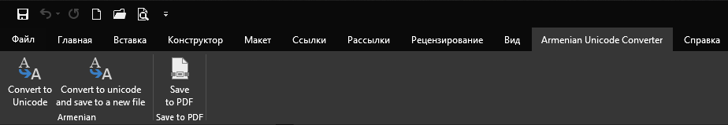
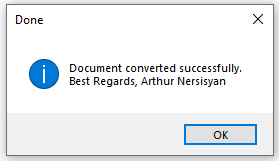

# Armenian Unicode Converter Word AddIn

Դուք կարող եք կարդալ այս էջը [in English](./README.md), [на Русском](./README_RU.md)

</br>


## Խնդիրը

Շատերի մոտ Microsoft Word-ում հայերեն տեքստի հետ աշխատելիս առաջացել են խնդիրներ տառերի ոչ ճիշտ ցուցադրման հետ:

Դա ունի այսպիսի տեսք.
```
г۳ëï³ÝÇ Ð³Ýñ³å»ïáõÃÛáõÝ
```

Չնայած պետք է լիներ հետևյալը:
```
Հայաստանի Հանրապետություն
```

Խնդիրը նրանում է, որ ձեր համակարգրչում բացայակում են որոշ տառատեսակներ (Fonts) (Times Armenian). Կարելի է, իհարկե, մեկ անգամ փնտրել, գտնել, տեղակայել այդ տառատեսակները և ընդմիշտ մոռանալ այս խնդրի գոյության մասին: Այս ամենց հետո Դուք, իհարկե, կազատվեք տաեռերի սխալ ցուցադրումից, բայց կունենաք նոր խնդիրներ տեքստը մի տառատեսակի բերելու և ընդհանուր ֆայլը ֆորմատավորելու ժամանակ: (Ինչո՞ւ: Որովհետև տառատեսակներից մեծամասնությունը աշխատում են միայն մեկ կոդավորման հետ՝ կամ `ASCII`, կամ `Unicode`, բայց ոչ երկուսն էլ:)


## Խնդրի լուծումը

Խնդրի լուծումը հետևյալն է. փոխել հին կոդավորմամբ տեքստը `Unicode`-ի:

Այս ընդլայնումը նախատեսված է Microsoft Word-ի համար:



Ընդլայնումը կարող է կատարել 3 գործողություն:

1. Կոճակ `Convert to Unicode` —  Տվյալ Word Document-ի ամբողջ տեքստը բերում է `Unicode` ֆորմատի
2. Կոճակ `Convert to Unicode and save to a new file` —  Պահպանում է տվյալ Word Document-ը, նույն պանակում (Папка, Folder, Directory) ստեղծում է նոր ֆայլ (`Save As`) նույն անունով, վերջում ավելացնելով `_unicode.docx`,  ապա նոր ստեղծած Word Document-ի ողջ տեքստը բերում է `Unicode` ֆորմատի, պահպանում է երկու ֆայլն էլ:
3. `Save to PDF` — Տվյալ Word Document-ից ստեղծում է `PDF`, պահպանում այն նույն պանակում (Папка, Folder, Directory), հետո բացում:

Առաջին քայլն ավարտելուց հետո ցուցադրվում է հետևյալ երկխոսության պատուհանը.



Երկրորդ քայլն ավարտելուց հետո ցուցադրվում է հետևյալ երկխոսության պատուհանը.


## Ինչպես տեղակայել (Установка, Installing)

System requirements:
1. Microsoft Windows 7/8/8.1/10 or above
2. Microsoft .NET FrameWork 4.7.2 or above
3. Microsoft Office Word 2016 or above

Տեղակայելու համար անհրաժեշտ է ներբեռնել հետևյալ ZIP արխիվը: [Armenian-Unicode-Converter.publish.zip](./Armenian-Uniocode-Converter.publish.zip) (650 Կբայթ)

Հանեք ֆայլերը արխիվից (Распаковка архива, Extract files) և բացեք `setup.exe`-ն:
